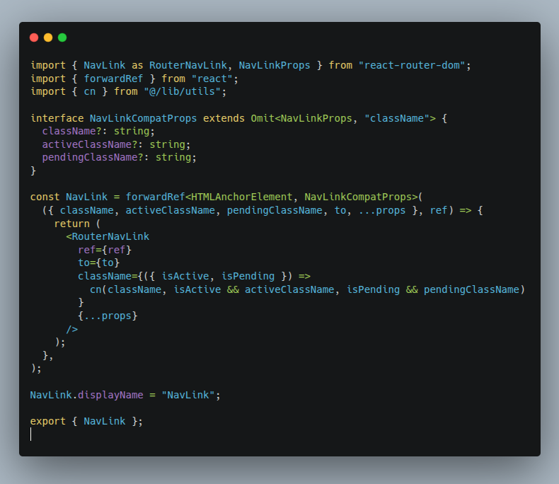
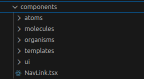
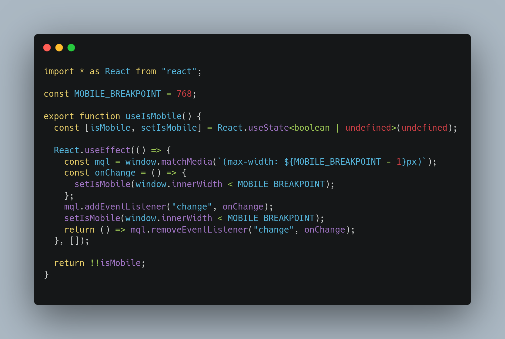
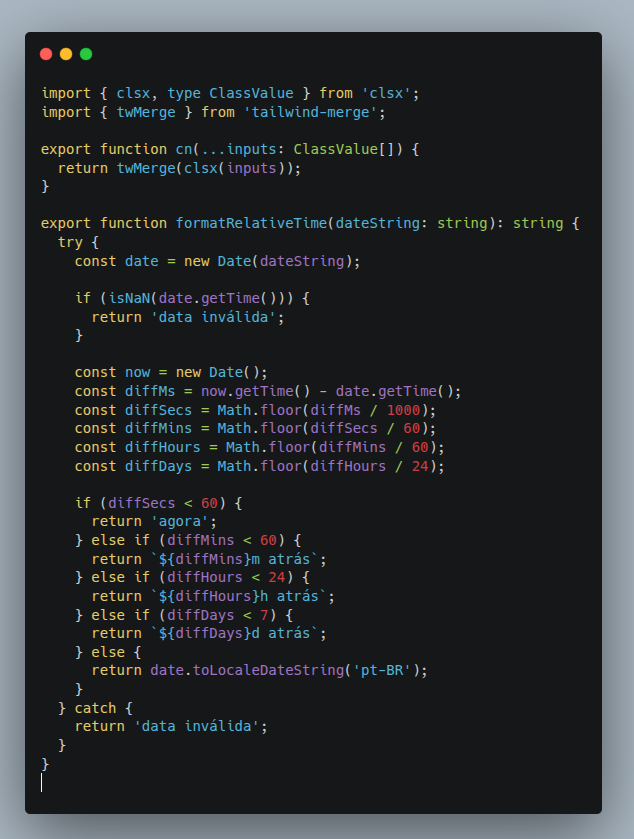
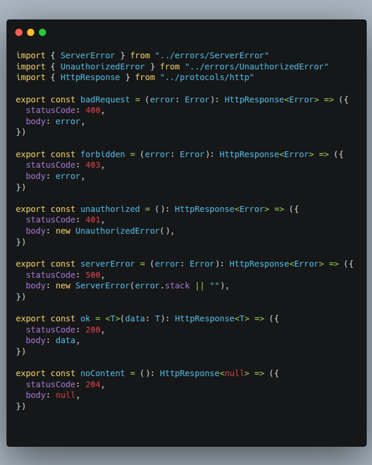
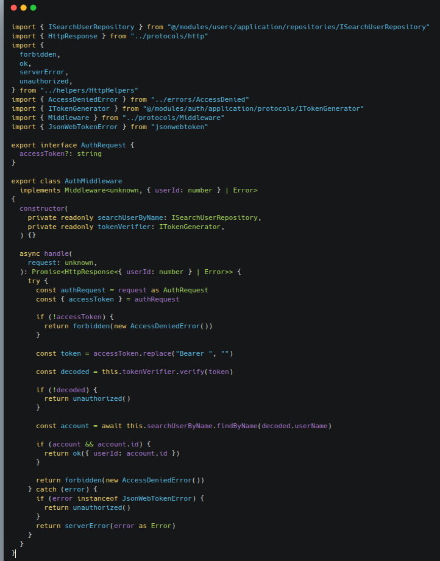
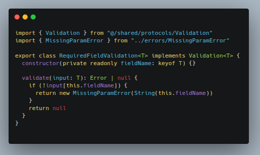

# 4.2. Módulo Reutilização de Software

## Introdução 

A reutilização de software é um paradigma fundamental na engenharia de software moderna, visando otimizar o processo de desenvolvimento e aprimorar a qualidade dos produtos. Este documento tem como objetivo mostrar o que foi feito dessa pratica em nosso projeto.

## Importância

- Produtividade Aumentada: Ao evitar a recriação de funcionalidades, as equipes podem entregar projetos mais rapidamente, focando em requisitos novos e específicos. Isso se traduz em um menor tempo de comercialização (time-to-market).
- Melhora da Qualidade: Ativos reutilizáveis geralmente passam por múltiplos ciclos de teste e refinamento, resultando em software mais robusto, com menos defeitos e mais confiável.
- Consistência Aprimorada: A reutilização de componentes padronizados garante que funcionalidades similares se comportem da mesma forma em diferentes partes de um sistema ou em sistemas distintos, promovendo uma experiência de usuário e de desenvolvimento mais coesa.
- Redução de Custos: Embora possa haver um investimento inicial na criação de ativos reutilizáveis, a longo prazo, a economia de tempo e esforço na manutenção e no desenvolvimento de novas funcionalidades compensa, diminuindo os custos totais do projeto.
- Manutenibilidade Facilitada: Ativos bem documentados e testados são mais fáceis de entender e manter. Quando um problema é corrigido em um componente reutilizável, a correção se propaga para todas as instâncias onde ele é utilizado.
- Aprendizado e Conhecimento Compartilhado: A criação e o uso de ativos reutilizáveis incentivam o compartilhamento de conhecimento e boas práticas entre as equipes, padronizando soluções para problemas comuns.

## Em nosso projeto

### 1 - Frontend 

### Componentes reutilizáveis 

---

---

- O componente NavLink (NavLink.tsx) é um exemplo de reutilização. Ele atua como um wrapper sobre o react-router-dom, centralizando comportamentos comuns de navegação e a aplicação de classes padrão. Isso reduz duplicação de código e garante consistência visual e funcional em toda a aplicação. As pastas atoms/, molecules/, organisms/ e templates/ seguem a metodologia Atomic Design, estruturando os componentes de forma hierárquica

### Hooks reutilizáveis 

---

---
- Os Hooks são funções personalizadas localizadas em frontend/src/hooks/* que encapsulam lógica de interface reutilizável em várias telas.Por exemplo,use-mobile.tsx contém a lógica para detectar se o dispositivo é móvel, permitindo que diferentes componentes acessem essa informação de forma consistente.

### Utilitários 

---

---
- Utilitário de estilo compartilhado por componentes.

#### 2 - backend 

### Helpers HTTP 
---

---
- Padronizam as respostas HTTP reutilizáveis entre controllers.

### Middlewares reutilizaveis 

---

---
- Encapsula verificação de token e busca de usuário — pode ser reutilizado por várias rotas.

### Validações reutilizáveis 
---

---
-  Permite compor validações em qualquer controller/service.

## Histórico de Versão
| Data       | Versão | Descrição                                                                                        | Autor                                                                                                                                                                                                                 | Revisores                                                                                                                                                              |
| ---------- | ------ | ------------------------------------------------------------------------------------------------ | --------------------------------------------------------------------------------------------------------------------------------------------------------------------------------------------------------------------- | ---------------------------------------------------------------------------------------------------------------------------------------------------------------------- |
| 20/11/2025 | `1.0`  | Criação do documento | [Jose Vinicius](https://github.com/JoseViniciusQueiroz)                                                                                                                                                                          |                                                                                                                                                                                                                                                                              